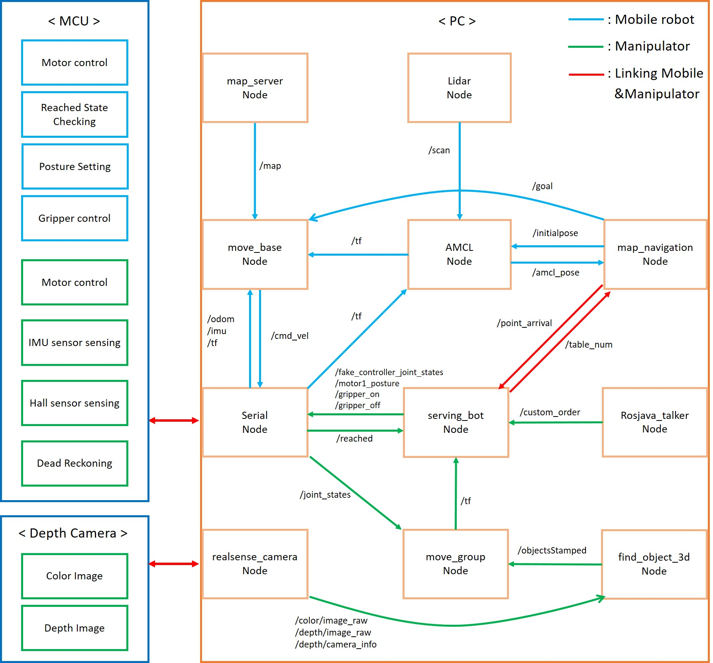
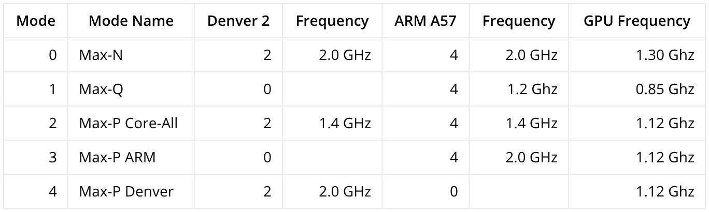

# Servingbot
These are packages for mobile manipulator control.
## Node Communication


## Scenario video
https://youtu.be/7-oHuMfVjQM

## Reference site
### Mobile robot
- #### RPlidar_ros : http://wiki.ros.org/rplidar
- #### Turtlebot3 : http://wiki.ros.org/turtlebot3
- #### Navigation tuning : http://emanual.robotis.com/docs/en/platform/turtlebot3/navigation/#tuning-guide
### Manipulator
- #### MoveIt : https://moveit.ros.org/
- #### Realsense : http://wiki.ros.org/RealSense
- #### Realsense in Jetson TX2 : https://www.jetsonhacks.com/2017/08/14/intel-realsense-camera-librealsense-nvidia-jetson-tx-dev-kits/
- #### Find_object : http://wiki.ros.org/find_object_2d

## Requirements
### Mobile robot
#### Install [SLAM and Navigation Package](http://emanual.robotis.com/docs/en/platform/turtlebot3/pc_setup/#install-dependent-ros-packages)
```bash
$ sudo apt-get install ros-kinetic-move-base
$ sudo apt-get install ros-kinetic-gmapping
```
 If you include the packages about navigation-kinetic-devel, you don't need you install below components
```bash
$ sudo apt-get install ros-kinetic-amcl
$ sudo apt-get install ros-kinetic-rosserial-python
$ sudo apt-get install ros-kinetic-map-server
$ sudo apt-get install ros-kinetic-range-sensor-layer
$ sudo apt-get install ros-kinetic-global-planner
$ sudo apt-get install ros-kinetic-dwa-local-planner
$ sudo apt-get install ros-kinetic-sensor-msgs
```
 If you have errors about turtlebot3_msgs, download the package.
```bash
$ cd ~/catkin_ws/src
$ git clone https://github.com/ROBOTIS-GIT/turtlebot3_msgs.git
```
### Manipulator
#### Install [Moveit](https://moveit.ros.org/install/)
```bash
$ sudo apt-get install ros-kinetic-moveit
```
#### Install [Realsense SDK 2.0](https://github.com/BeomSol/servingbot_ros/tree/master/serving_arm/realsense_ros)
 This robot used librealsense v2.10.3 and realsense_ros 2.0.4.
#### Set object image folder location
 Modify the objects folder path of find_object_3d_D415.launch
```bash
<param name="objects_path" value="~/Pictures/objects" type="str"/>
```
### Application
 Download [App](https://github.com/BeomSol/rosjava_catkin_package_a)

## Setup for embedded PC 
### Time synchronization
If this command doesn't work, you will have to fix it manually.
```bash
$ sudo ntpdate -u time.bora.net
```
### Power mode setting for Jetson TX2


```bash
$ roslaunch servingbot_bringup servingbot_robot.launch
```

## How to run "ServingBot"
### Run Mobile Manipulator
- #### Mobile robot
 Excute the Mobile robot with navigation

1. <pre><code> $ roslaunch servingbot_navigation servingbot_navigation_all.launch </code></pre>

- #### Manipulator
 Excute the Manipulator with find objects

2. <pre><code> $ roslaunch manipulator_moveit_config_second manipulator_all.launch </code></pre>

- #### Simple_navigation_goal
 Excute the package that stores location information

3. <pre><code> $ rosrun simple_navigation_goals_pose simple_navigation_goals_pose </code></pre>

- #### App communication
 Receive order information from Tablet

4. <pre><code> $ rosrun rosjava_catkin_package_a my_pub_sub_tutorial com.github.rosjava.rosjava_catkin_package_a.my_pub_sub_tutorial.Talker </code></pre>

### Run only Mobile robot
- #### Bringup
 Excute the robot
```bash
$ roslaunch servingbot_bringup servingbot_robot.launch
```
- #### Mapping
 Excute slam with gmapping
```bash
$ roslaunch servingbot_slam servingbot_slam.launch
```
 Teleoperation using keyboard
```bash
$ roslaunch servingbot_teleop servingbot_teleop_key.launch
```
 Save the map
```bash
$ rosrun map_server map_saver -f {file_name}
```
- #### Navigation
 Excute the navigation package
```bash
$ roslaunch servingbot_navigation servingbot_navigation.launch
```
 Excute the package that stores location information
```bash
$ rosrun simple_navigation_goals_pose simple_navigation_goals_pose
```
### Run only Manipulator
- #### Bringup
 Excute the robot
```bash
$ roslaunch servingbot_bringup servingbot_core.launch
```
- #### MoveIt
 Direct control of the Manipulator with Rviz
```bash
$ roslaunch manipulator_moveit_config_second demo.launch
```
### Etc
- #### Excute realsense device
```bash
$ roslaunch realsense2_camera rs_camera.launch
```
- #### Excute find objects
 Excute only find objects
```bash
$ roslaunch find_object_2d find_object_3d.launch
```
 Excute find objects with D415
```bash
$ roslaunch find_object_2d find_object_3d_D415.launch
```
- #### Communication between Mobile robot and Manipulator
```bash
$ roslaunch serving_bot serving_bot.launch
```
